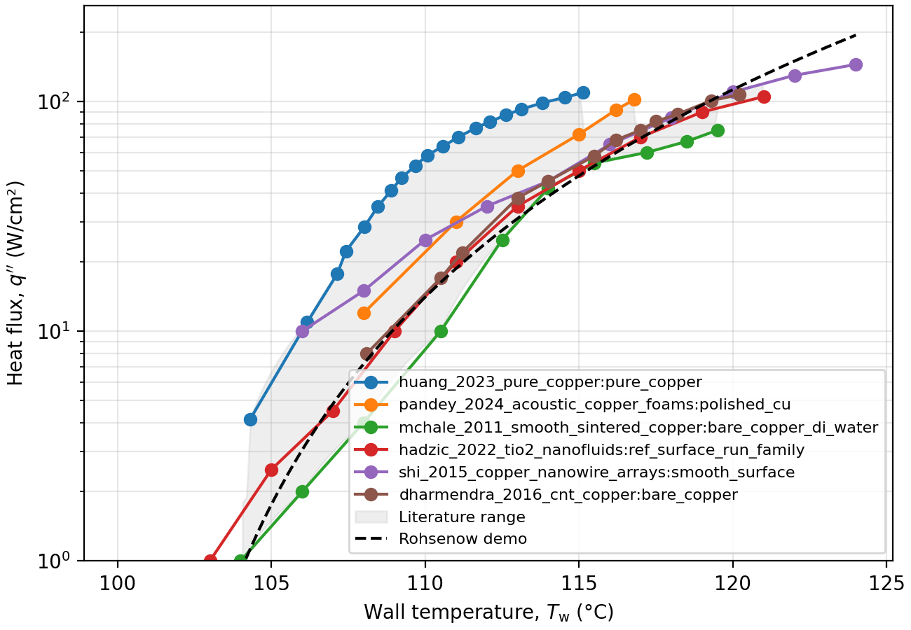
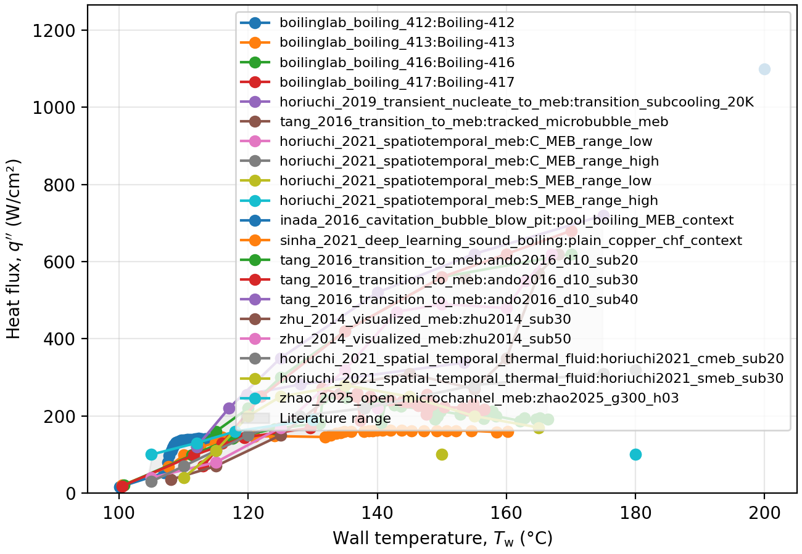
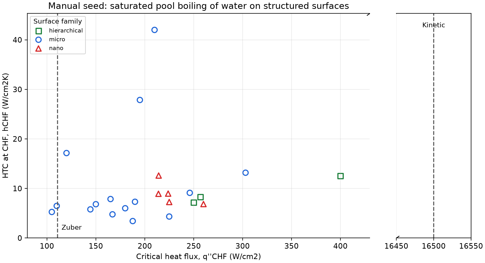

# literature-compiler

`literature-compiler` is a community workflow and Python toolkit for compiling quantitative literature data with explicit provenance.

The project is organized around research-question cases. Each case defines a focused question, registers relevant papers, extracts reported or digitized data, compiles canonical variables, and produces comparison plots that others can inspect and improve.

The repository contains research cases, not generic examples. Each case has its
own question, data boundary, provenance notes, and current evidence status.

## Case gallery

Each panel is a live entry point to its case folder. These are current compiled
results, but their status labels matter: the gallery does **not** imply that a
case is a validated benchmark or that its data are ready for model training.

<table>
  <tr>
    <td width="33%" align="center">
      <a href="examples/test1_boiling_curve/"></a><br>
      <strong>Boiling curve</strong><br>Demo scaffold
    </td>
    <td width="33%" align="center">
      <a href="examples/test2_meb/"></a><br>
      <strong>Microbubble emission boiling</strong><br>First-pass screening scaffold
    </td>
    <td width="33%" align="center">
      <a href="examples/test3_htc_chf_structured_surfaces/"></a><br>
      <strong>HTC at CHF vs. CHF</strong><br>Manual seed and verification scaffold
    </td>
  </tr>
</table>

## What the toolkit does

- Provides a repeatable workflow for community literature-compilation cases.
- Registers literature sources and experimental-condition metadata.
- Converts reported or digitized data into canonical variables and units.
- Supports human-in-the-loop semi-automatic digitization from figure images.
- Preserves provenance for each data point: paper, figure/table, curve, extraction method, confidence, units, and notes.
- Plots literature data and optional reference correlations.
- Creates deterministic source-group splits for benchmark evaluation.
- Exports conservative provenance manifests for NED3 Thermal AI Commons.

## Community Workflow

Each case should document:

- research question;
- inclusion and exclusion criteria;
- source registry;
- extraction method;
- canonical variables and units;
- compiled dataset;
- comparison plot;
- provenance notes;
- known gaps and requested community contributions.

See [docs/community-workflow.md](docs/community-workflow.md), [docs/case-template.md](docs/case-template.md), and [CONTRIBUTING.md](CONTRIBUTING.md).

Shared bibliographic metadata lives in [references/sources.yaml](references/sources.yaml). Individual cases link to those records and add case-specific screening or extraction notes. See [docs/reference-hub.md](docs/reference-hub.md).

## Install

```powershell
python -m pip install -e .[dev]
```

## Quick Start

```powershell
litcomp version
litcomp refs validate
litcomp plot-csv examples/test1_boiling_curve/data/reported_points.csv results/test1_boiling_curve.png --with-models
litcomp benchmark split examples/test1_boiling_curve/data/literature_points.csv results/test1-source-split.json --dataset-id test1-v0.1 --seed 42
litcomp commons export-manifest examples/test1_boiling_curve/data/literature_points.csv --case examples/test1_boiling_curve/case.yaml results/test1-commons-manifest.json
```

The case data may be demonstration, screening, reported, digitized, or measured
records. Read the individual case status and provenance fields before reuse;
they are not automatically a complete literature review or training dataset.

## Python Usage

```python
from litcomp.schema import DataPoint
from litcomp.plotting import plot_boiling_curve

points = [
    DataPoint(
        paper_id="demo_literature",
        curve_id="flat_copper",
        x_value=10,
        x_unit="K",
        y_value=125,
        y_unit="kW/m^2",
        source_type="reported_table",
        extraction_method="demo",
    )
]

plot_boiling_curve(points, "results/example.png", include_rohsenow=True)
```

## Paper Access Policy

This project does not bypass paywalls, institutional authentication, publisher licenses, or copyright limits. Use authorized access to obtain papers. Zotero is the preferred bridge for storing PDFs, DOI metadata, tags, BibTeX keys, and local attachment paths.

Do not commit restricted PDFs or publisher figures unless redistribution is allowed. Store metadata, local file references, extracted quantitative data, synthetic figures, and open/example assets instead. Model training, weights, and public benchmark release require a source-specific rights review; extraction alone does not establish those rights.

## Development

```powershell
python -m pytest -q
```
